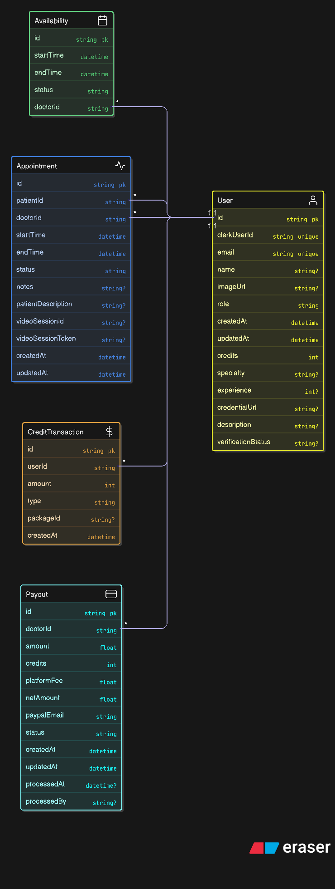

<h1 align="center">🏥 HealthCheckBuddy</h1>

<p align="center"><em>A Modern Healthcare Consultation Platform — Bridging Patients & Doctors Seamlessly.</em></p>

<p align="center">
  
  
  
  
  
  
  
</p>

---

## 🚀 **Overview**

**HealthCheckBuddy** is a full-stack healthcare consultation platform built for modern telemedicine.  
It allows users to explore transparent pricing, book doctor appointments, and connect through secure online consultations — all within a clean, responsive, and accessible interface.

🩺 Designed to simplify healthcare access  
⚙️ Built with **Next.js, Prisma, and Neon (Postgres)**  
💡 Focused on **clarity, security, and scalability**

---

## 📸 **Screenshots**

<div align="center">

<table>
  <tr>
    <td width="50%">
      
      <p align="center"><em>🏠 Landing Page & Dashboard</em></p>
    </td>
    <td width="50%">
      
      <p align="center"><em>📋 Doctor Consultation Interface</em></p>
    </td>
  </tr>
</table>

</div>

---

## 🎥 **Demo Video**

<div align="center">

[](https://drive.google.com/file/d/1y8wslZZCmL31tTClPxtr81pAAZfposhS/view?usp=drive_link)

**Click above to watch the full platform walkthrough** 👆

</div>

---

## ⚡ **Performance Metrics**

<div align="center">

*Production deployment monitored with Chrome DevTools & Lighthouse*

<table>
  <tr>
    <th width="50%">Baseline Metrics</th>
    <th width="50%">Metrics After Optimization</th>
  </tr>
  <tr>
    <td align="center">
      
    </td>
    <td align="center">
      
    </td>
  </tr>
  <tr>
    <td>
      <strong>Initial Scores:</strong><br/>
      • Lighthouse: 82/100<br/>
      • FCP: 1.2s<br/>
      • LCP: 1.8s<br/>
      • Total Blocking Time: 20ms<br/>
      • Speed Index: 3.5s
    </td>
    <td>
      <strong>After Feature Integration:</strong> ⚡<br/>
      • Lighthouse: 93.5/100<br/>
      • FCP: 0.3s<br/>
      • LCP: 0.6s<br/>
      • Total Blocking Time: 0ms<br/>
      • Speed Index: 1.1s
    </td>
  </tr>
</table>

### 🎯 Lighthouse Audit Results (Avg) 

<table>
  <tr>
    <th>Metric</th>
    <th>Score</th>
    <th>Status</th>
  </tr>
  <tr>
    <td><strong>Performance</strong></td>
    <td>87.5/100</td>
    <td>✅ Good</td>
  </tr>
  <tr>
    <td><strong>First Contentful Paint</strong></td>
    <td>0.7s</td>
    <td>✅ Excellent</td>
  </tr>
  <tr>
    <td><strong>Largest Contentful Paint</strong></td>
    <td>1.2s</td>
    <td>✅ Excellent</td>
  </tr>
  <tr>
    <td><strong>Speed Index</strong></td>
    <td>2.3s</td>
    <td>✅ Good</td>
  </tr>
  <tr>
    <td><strong>Total Blocking Time</strong></td>
    <td>10ms</td>
    <td>✅ Excellent</td>
  </tr>
  <tr>
    <td><strong>Cumulative Layout Shift</strong></td>
    <td>0</td>
    <td>✅ Perfect</td>
  </tr>
</table>

### 🚀 Built-in Optimizations (Next.js + Vercel)

**Framework-level optimizations:**

✅ Automatic image optimization (WebP conversion, responsive images)  
✅ Code splitting & lazy loading (route-based chunking)  
✅ Static generation for faster page loads  
✅ CDN delivery via Vercel Edge Network  
✅ Automatic font optimization with next/font  
✅ Bundle size optimization (tree shaking, minification)

**Database optimizations:**

✅ Prisma query optimization with selective field fetching  
✅ Connection pooling via Neon serverless PostgreSQL  
✅ Indexed database queries for faster lookups

*Metrics verified on production deployment using Chrome Lighthouse*

</div>

---

## 🗄️ **Database Schema**

<div align="center">

### Entity Relationship Diagram



*Built with Prisma ORM - Scalable relational data model for healthcare workflows*

</div>

### 📊 **Core Entities**

| Entity | Purpose | Key Relationships |
|--------|---------|-------------------|
| **User** | Patient/Doctor authentication & profiles | → Appointments, Availability, Payouts |
| **Appointment** | Consultation bookings & scheduling | ← User (Patient/Doctor), → CreditTransaction |
| **Availability** | Doctor schedule management | ← User (Doctor) |
| **CreditTransaction** | Payment tracking & financial records | ← Appointment |
| **Payout** | Doctor earning settlements | ← User (Doctor) |

**Key Design Principles:**
- 🔐 Secure user authentication with role-based access (Patient/Doctor/Admin)
- 💳 Comprehensive transaction tracking for transparency
- 📅 Flexible availability system for doctor scheduling
- 🎥 Video consultation integration with session management
- 💰 Automated payout system for doctor earnings

---

## 🌟 **Key Features**

✅ **Doctor Appointment Booking** — Book consultations with verified doctors.  
✅ **Transparent Pricing Page** — No hidden charges; every service clearly listed.  
✅ **Patient & Doctor Dashboards** — Personalized panels for managing appointments.  
✅ **Video Consultation Support** — Real-time doctor–patient interaction (Vonage).  
✅ **Secure Authentication** — Protected routes for patients, doctors, and admins.  
✅ **Admin Panel** — Manage doctors, payouts, and overall system data.  
✅ **Modern UI/UX** — Built with Tailwind CSS & Lucide Icons for a polished interface.

---

## 🗂️ **Project Structure**

| Path | Responsibility |
|------|----------------|
| `app/(main)/pricing/page.jsx` | Main pricing page with consultation packages, FAQs, and contact form. |
| `app/(auth)/sign-in` / `sign-up` | Authentication routes for user registration & login. |
| `components/ui/` | Reusable UI components (Header, Pricing, Cards, Theme Provider). |
| `actions/` | Server-side logic for appointments, onboarding, admin control, etc. |
| `prisma/schema.prisma` | Database schema for users, doctors, and consultations. |
| `lib/db.js` | Prisma + Neon PostgreSQL database connection. |
| `hooks/use-fetch.js` | Custom data fetching hook. |
| `public/` | Static assets and icons. |

---

## 🛠️ **Technology Stack**

| Category | Technologies |
|-----------|---------------|
| **Frontend** | Next.js, React, Tailwind CSS |
| **Backend** | Node.js (Next.js API Routes) |
| **Database** | Prisma ORM + Neon (PostgreSQL) |
| **Icons & UI** | Lucide Icons, ShadCN UI |
| **Deployment** | Vercel / Render-ready |

---

## ⚙️ **Platform Workflow**

### 1️⃣ **Landing & Navigation**
- Users explore transparent consultation pricing and navigate via a clean layout.

### 2️⃣ **Transparent Pricing**
- Packages and FAQs dynamically rendered from modular pricing components.

### 3️⃣ **Doctor & Patient Flow**
- Doctors manage profiles, appointments, and payouts.
- Patients can book, cancel, or reschedule appointments with ease.

### 4️⃣ **Contact & Support**
- Integrated contact form for queries, handled via backend API routes.

### 5️⃣ **Database & Backend**
- Prisma ORM connects to Neon-hosted Postgres database with schema-based validation.

### 6️⃣ **UI & Experience**
- Tailwind CSS ensures responsive, mobile-first design.
- Lucide Icons maintain a minimal, professional visual tone.

---

## 🧑‍💻 **Local Setup & Development**

### 🔹 Clone the Repository
```bash
git clone https://github.com/swarnabha-dutta/Health_Check_Buddy.git
cd HealthCheckBuddy
```

### 🔹 Install Dependencies

```bash
npm install
# or
yarn install
```

### 🔹 Configure Environment Variables

Create a `.env` file in the root directory:

```bash
DATABASE_URL=your_neon_db_url
NEXT_PUBLIC_API_KEY=your_api_key_if_any
```

### 🔹 Push Prisma Schema

```bash
npx prisma db push
```

### 🔹 Run the Development Server

```bash
npm run dev
# or
yarn dev
```

### 🔹 Visit

👉 [http://localhost:3000](http://localhost:3000)

---

## 📦 **Deployment**

Deploy easily on **Vercel**, **Render**, or **Netlify**.  
✅ Add your environment variables in the platform's settings.  
✅ Neon Postgres ensures a **serverless, auto-scaling backend**.

---

## 🧩 **Future Enhancements**

* 🧠 AI-powered symptom checker
* 📊 Doctor can see Patient History through Analytics Dashboard
* 🔔 Realtime Email & Notifications for doctor payouts, appointment success/failure, and reminders 30 minutes before appointments

---

## 💼 **Project Highlights**

* ✅ Scalable architecture using **Next.js + Prisma + Neon**
* ✅ Modular, enterprise-grade folder structure
* ✅ Fully responsive UI with Tailwind CSS
* ✅ Secure authentication and optimized API routes
* ✅ Designed for real-world healthcare workflows

---

## 🧠 **Learning Outcomes**

* Deep understanding of **Next.js App Router architecture**
* Real-world integration of **Prisma ORM with Neon DB**
* Improved **modular frontend design** using ShadCN UI
* Hands-on experience with **deployment pipelines (Vercel)**

---

## 📬 **Contact**

👤 **Developer:** Swarnabha Dutta  
📧 **Email:** [swarnabhadutta909@gmail.com](mailto:swarnabhadutta909@gmail.com)  
🔗 **LinkedIn:** [swarnabha-dutta](https://www.linkedin.com/in/swarnabhadutta909/)  
🌐 **Portfolio:** [animated-3-d-portfolio.vercel.app](https://animated-3-d-portfolio.vercel.app/)

---

<p align="center">Made with ❤️ for better healthcare access</p>
